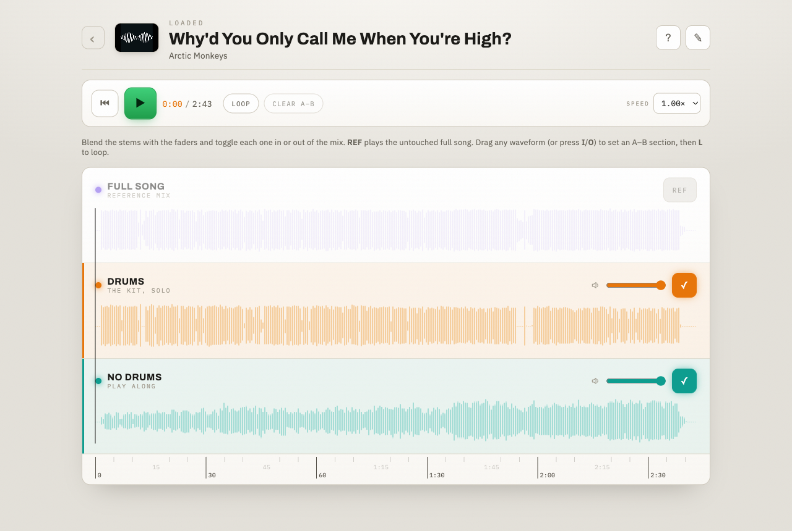

# SongCoach 🥁

**Isolate the drums. Loop the fill. Lock in the groove.**



SongCoach is a local macOS app for drummers. Play any song through your Mac — a
YouTube tab, Spotify, Apple Music, a file — and SongCoach captures the audio and
uses an AI source-separation model ([Demucs](https://github.com/adefossez/demucs))
to split it into four stems:

- **the full song** (reference mix),
- **drums only** — hear exactly what the drummer played,
- **vocals only**, and
- **backing** — bass, keys & the rest, with drums and vocals removed.

Then it hands you a player with synced, colour-coded waveforms, a per-stem mixer,
A–B looping, pitch-preserved slow-down, and **markers** you can drop to flag a
fill or a solo — so you can drill any four bars until they're yours.

Everything runs on your machine. No account, no cloud, no upload — your
recordings never leave your Mac.

---

## Download & install

> **macOS 13+ · Apple Silicon (M-series).** Signed & notarized — no right-click
> "Open" workaround needed.

1. Download the latest **`SongCoach.dmg`** from the
   [**Releases**](https://github.com/nigelfds/songcoach/releases) page.
2. Open the DMG and drag **SongCoach** into **Applications**.
3. Launch it. On first capture, macOS asks for **Screen & System Audio
   Recording** — grant it in *System Settings → Privacy & Security*, then
   relaunch SongCoach. (This permission is what lets it hear your system audio;
   it's granted to SongCoach itself.)

That's it — nothing else to install. Python, ffmpeg, the AI model, and the
capture helper are all bundled.

Prefer to run from source or build your own `.app`? See
[**For developers**](#for-developers) below.

---

## Using it

Pick how you want to feed audio in:

**▶ Record from YouTube** — paste a link; SongCoach loads the video in-app. Hit
**Start Capture** and it plays and records the video for you, stopping
automatically when it ends.

**♪ Record from system audio** — for anything else (Apple Music, Spotify,
SoundCloud, a local file). Enter a song name (and, optionally, an artist and a
cover-image URL), start the capture **before** the audio begins, play it, and
stop when it's done.

**♫ Apple Music mode** — hit **Start Apple Music mode**, then play a song or
playlist in Apple Music. SongCoach captures each song automatically, pauses when
you pause, and queues every finished song for stems — song after song — until you
click **Stop**. (First use asks macOS for permission to read Apple Music.)

Either way, Demucs runs for a minute or two, then the player opens. In the
player:

- synced waveform rows — **full song / drums / vocals / backing** — each with a
  volume fader and an in-the-mix toggle (**REF** plays the untouched full mix),
- **drag on any waveform** to set an **A–B loop**,
- **0.5×–1×** slow-down that preserves pitch,
- **markers** — click the flag icon, then click a waveform to drop a named marker
  (a line across all stems with an "i" badge) that flags a fill, solo, or
  transition; click the badge to rename or delete it,
- keyboard shortcuts for play/pause, section in/out, and looping (see the **?**
  in the app).

Your **library** lists every recording — **search** by title/artist and page
through it — and you can **delete** a recording from its player (a soft delete;
the files on disk are never touched). If a separation ever fails, the recording
is kept and you can **retry** it without re-recording.

### Move your library to another Mac

Your whole library lives in one folder, so moving it is two clicks. On the old
Mac, hit **Export** to download a `SongCoach-export-….zip`. Copy it over
(AirDrop, USB, wherever), then on the new Mac hit **Import** and pick the zip —
your recordings merge in (anything with the same ID is overwritten) and the
library reloads. Nothing leaves your machines but the file you carry.

### Add the vocals stem to older recordings

Recordings made before the vocals stem existed show three rows. To upgrade one,
open its player and hit the **reprocess** button (the circular-arrows icon) — it
re-separates the song into the current four stems (your markers are kept). To
bring the whole back catalogue up to speed at once, run
`python -m songcoach.reprocess` (see [For developers](#for-developers)).

---

## How it works

```
Browser (WaveSurfer.js UI)
        │  1. pick a mode, enter details, Start   ┌─────────────────────────┐
        ▼                                          │  native/syscap (Swift)  │
FastAPI app  ──start/stop capture──►  Recorder ────┤  ScreenCaptureKit tap   │
        │                                          │  → capture.m4a          │
        │ poll job status                          └─────────────────────────┘
        ▼                                                 │ on Stop
   Player page  ◄── /media stem URLs ──┐                  ▼
                                       │   background thread: Demucs
                                       └── SQLite + local filesystem (./data)
                                              → drums · vocals · backing · original (.mp3)
```

- **Capture** — `native/syscap.swift`, a small **ScreenCaptureKit** helper, taps
  the Mac's system-audio output to an `.m4a`. No BlackHole / virtual audio device
  needed.
- **Separation** — **Demucs** (`htdemucs`) splits into **drums**, **vocals**, and
  **backing** (bass + other summed), written as 256 kbps mp3s **in-process** so it
  works inside the frozen app. A single-worker queue runs one separation at a time,
  so back-to-back captures never spawn concurrent Demucs runs.
- **Web** — FastAPI + Jinja2 + Uvicorn. Single-user, so separation runs inline in
  a daemon thread and the UI polls status.
- **Storage & DB** — stems live on the local filesystem; **SQLite** is a
  disposable index rebuilt from disk on launch (see [Data model](#data-model--the-db-is-a-cache)).
- **Frontend** — [WaveSurfer.js v7](https://wavesurfer.xyz/) waveforms + the
  Regions plugin for select-and-loop.

---

## For developers

### Run from source

```bash
brew install pyenv ffmpeg
pyenv install 3.11.9          # Demucs/PyTorch need 3.11
pyenv local 3.11.9
python -m venv .venv && source .venv/bin/activate
pip install -r requirements.txt

# Build the native capture helper (the compiled binary is git-ignored):
swiftc -O native/syscap.swift -o native/syscap

# Run:
uvicorn songcoach.main:app --reload   # → http://localhost:8000
```

**Capture permission in dev:** the first capture fails until macOS grants
**Screen & System Audio Recording** to the app hosting the process — in dev
that's your **terminal** (Terminal / iTerm / VS Code), since it's the
"responsible process" for `syscap`. Enable it in *System Settings → Privacy &
Security → Screen & System Audio Recording*, then **fully quit and reopen** that
app (TCC changes only apply after a restart). The error
`The user declined TCCs for … display capture` is this permission.

### Tests

```bash
python -m pytest        # separator, reprocess, markers, export/import, rebuild, delete, API endpoints
```

### Build a signed `.app` + DMG

The app is packaged with PyInstaller and distributed as a Developer ID–signed,
notarized `.dmg`. Full runbook — cert setup, signing, notarization, DMG — is in
[`docs/packaging.md`](docs/packaging.md). In short:

```bash
scripts/build_macapp.sh      # → dist/SongCoach.app (unsigned)
scripts/release_macapp.sh    # build → sign → dmg → notarize + staple
```

### Configuration

Env-driven (`.env`, via pydantic-settings); defaults work out of the box. Notable
knobs: `DATABASE_URL`, `LOCAL_STORAGE_DIR` (default `./data`), `SYSCAP_BIN`,
`DEMUCS_MODEL` (default `htdemucs`), `MAX_DURATION_SECONDS` (capture cap, default
600).

### Data model — the DB is a cache

The **source of truth is the filesystem**, not SQLite. Every recording lives in
its own folder with its stems and a JSON sidecar:

```
data/jobs/<job-id>/
├── original.mp3
├── drums.mp3
├── vocals.mp3
├── no_drums_no_vocals.mp3    # backing (older recordings have no_drums.mp3 instead)
├── thumbnail.jpg             # optional
└── meta.json                 # schema_version, title, artist, duration, tracks, markers, deleted?
```

`songcoach.db` is a rebuildable index over those folders. Delete it, move `data/`
to another machine, or hand-edit a `meta.json`, then:

```bash
python -m songcoach.rebuild            # drop + recreate the DB from disk
python -m songcoach.rebuild --merge    # upsert without dropping existing rows
```

The rebuild derives each recording's tracks from the mp3s actually present (files
win over the sidecar) and also surfaces failed/orphaned captures as retryable. A
`meta.json` marked `"deleted": true` is skipped (that's how the soft delete works).

Re-separate the library into the current stem set (e.g. after the vocals stem was
added) — runs one song at a time, sourcing from each recording's `original.mp3`:

```bash
python -m songcoach.reprocess          # every recording still missing a vocals stem
python -m songcoach.reprocess --force   # re-separate all finished recordings
```

### Project layout

```
songcoach/
├── native/syscap.swift        # ScreenCaptureKit system-audio helper
├── songcoach/
│   ├── main.py                # FastAPI app factory + routes wiring
│   ├── config.py · db.py · models.py · storage.py
│   ├── metadata.py            # meta.json sidecar (source of truth)
│   ├── rebuild.py             # rebuild the SQLite cache from disk
│   ├── fetch_thumbnails.py    # YouTube + user-supplied cover thumbnails
│   ├── jobs.py · recording.py # background dispatch + active-capture session
│   ├── desktop.py             # frozen-app launcher (pywebview shell)
│   ├── pipeline/              # recorder · process · separator (Demucs)
│   ├── routes/ · templates/ · static/
├── scripts/                   # build_macapp · sign · make_dmg · notarize · release
├── packaging/entitlements.plist
├── docs/packaging.md
└── tests/
```

---

## Roadmap

Legend: ✅ done · ⬜ not started

- ✅ System-audio capture (ScreenCaptureKit) → Demucs stems → synced-waveform player
- ✅ Four stems — full / drums / **vocals** / backing — with a per-stem mixer
- ✅ A–B loop, solo, pitch-preserved slow-down
- ✅ Two capture modes (in-app YouTube player + manual system audio)
- ✅ Apple Music mode — auto-capture a playlist song-by-song into the stem queue
- ✅ **Waveform markers** — drop named markers across all stems, saved with the recording
- ✅ **Reprocess** a recording (per-song button) or the whole library (`python -m songcoach.reprocess`)
- ✅ Library **search + pagination**
- ✅ **Delete** a recording (soft delete — the files on disk stay put)
- ✅ Retry a failed/interrupted separation without re-recording
- ✅ Export / import your library as a `.zip` (move it between Macs)
- ✅ Packaged as a signed & notarized macOS `.app`
- ✅ Test suite (separator, reprocess, markers, export/import, rebuild, delete, API)
- ⬜ Metronome / count-in overlay
- ⬜ Universal2 / Intel build; a lighter separation engine to shrink the download
- ⬜ Auto-update (Sparkle)
- ⬜ Edge case: a YouTube job that hard-crashes *mid-stem* resurrects as a stuck
  job with no Retry button (see the note in `docs/` — non-YouTube captures and
  normal failures are already covered)

---

## A note on what you record

SongCoach separates audio you already have access to, on your own machine, for
personal practice. The stems it makes stay local — they're never uploaded. Please
respect the rights of the music you work with.

## License

[MIT](LICENSE) © 2026 Nigel Fernandes. (The license covers SongCoach's code —
not the music you separate with it.)

Built for drummers. 🥁
